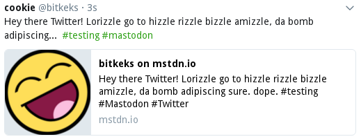

# Mastodon-to-Twitter Mirrorbot

This Python3 script loads the latest Toots from your Mastodon account and tweets them on Twitter.
Some formatting is done to keep the content of Tweets in 140 characters (might be expanded when Twitter rolls out 280 chars for everyone).

Your Tweets will contain some of your original Hashtags. Set the config option `tags_to_append` for this.

## Setup
Fill the config values `api_base_url` and `user_base_url` as given in the example. The API base URL is most likely the root domain of your instance, the user base URL is a simple text string which is used to check Tweets that contain Mastodon URLs to your Toots. (Better have a look into the code, it gets clear there)

## Libraries and tokens
This bot uses [Python-Twitter](https://python-twitter.readthedocs.io/en/latest/getting_started.html) and [Mastodon.py](https://mastodonpy.readthedocs.io/en/latest/). To set up the needed access keys/tokens follow the instructions there.
